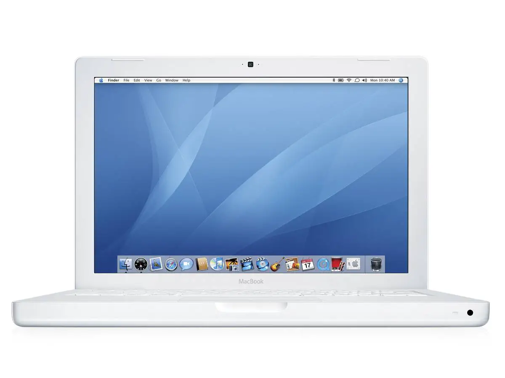

# MacBookPro-Early2008-Fansite

## This is the fansite for the  MacBookPro (Early 2008)
> I made this because it was the computer that my parents had when I was a kid and it was an important part of my childhood. 
___

#### Specs compared to my _current_ laptop:

| |   MacBookPro-Early 2008    |    MacBook Air M1 2020     |
| :-------------: | :-------------: |:-------------:| 
| Storage |  80 GB HDD    |     256GB SSD     |    
| RAM |  2GB    |    8GB       |     
| Processor  | 1.6GHz Core 2 Duo (P7500)| 5-nm 3.2 GHz Apple M1 processor |
| Graphics Card | Intel GMA X3100 with 144 MB | 7-Core Integrated GPU |

[Computer Specs Site](https://www.sellyourmac.com/mac-product-guides/macbook-air/mb003ll-a-13-macbook-air-early-2008-1-6-ghz-core-2-duo.html#:~:text=The%2013%22%20MacBook%20Air%20(Early,and%202GB%20of%20Integrated%20RAM)%22/")
<kbd>[Site]((https://www.sellyourmac.com/mac-product-guides/macbook-air/mb003ll-a-13-macbook-air-early-2008-1-6-ghz-core-2-duo.html#:~:text=The%2013%22%20MacBook%20Air%20(Early,and%202GB%20of%20Integrated%20RAM)%22/ )</kbd>

##### This is an image of the computer[^1].

[^1]:[Image Site](https://madeapple.com/macbook-13-inch-early-2008/")

My Computer: 

